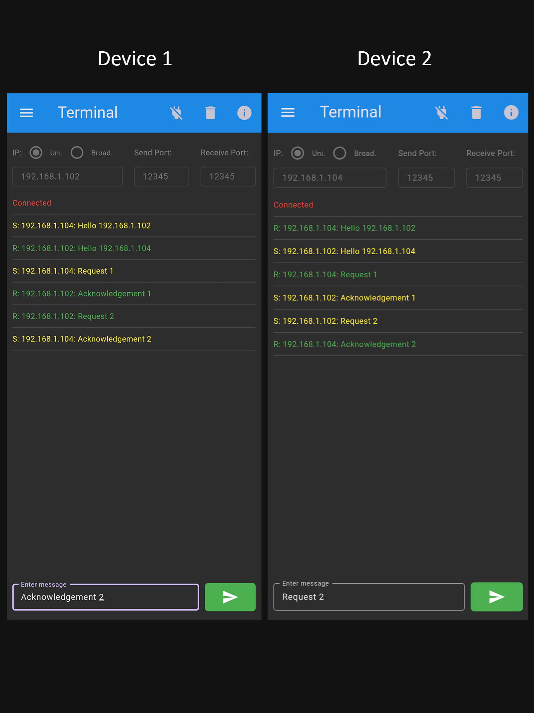
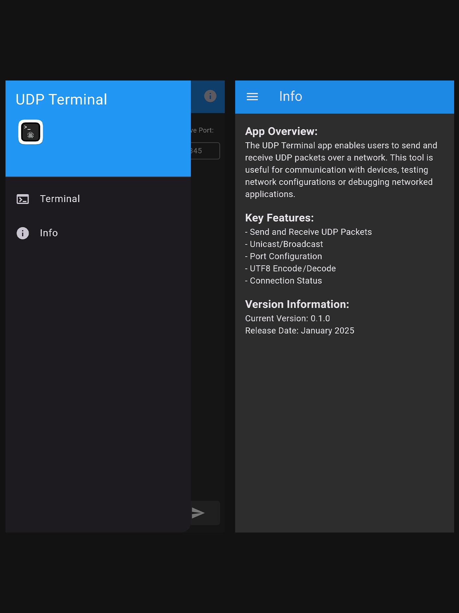
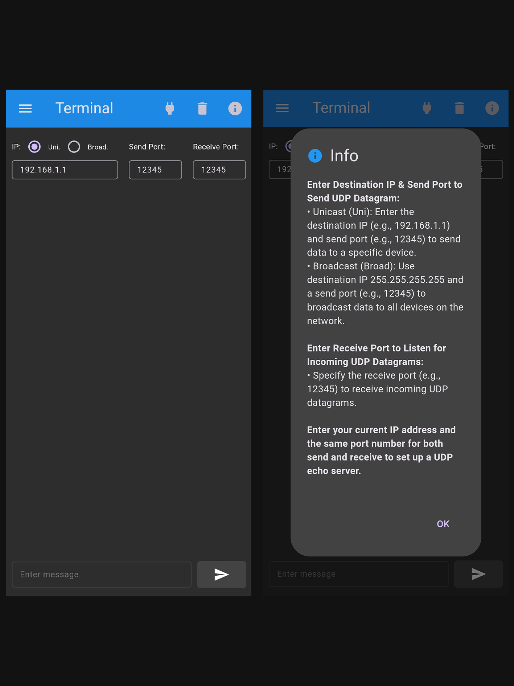

# UDP Terminal

## 🌐 Introducing the UDP Terminal App 🚀
The UDP Terminal app enables users to send and receive UDP packets over a network. This tool is useful for communication with devices, testing network configurations or debugging networked applications.

## 🔑 Key Features:
📡 Send and Receive UDP Packets  
🌍 Unicast/Broadcast Support  
⚙️ Customizable Port Configuration  
🔡 UTF8 Encoding and Decoding  
✅ Real-Time Connection Status  

## 🌟 Why I Built This?
Working on this app allowed me to combine my interest in networking with my passion for app development using Flutter. It's been a fulfilling journey turning an idea into a tool that can help others in the tech community.

## 📂 Check It Out
🔗 GitHub Repository: https://github.com/NipunDharmarathne/flutter_udp_terminal  
📱 APK Release: https://github.com/NipunDharmarathne/flutter_udp_terminal/releases/download/v0.1.0/app-release.apk
The app is open-source, and the code is available for anyone who’d like to explore, enhance or develop it further. I'd love to hear your thoughts, suggestions or feedback! If you find this app useful or think it could help someone you know, feel free to share it or drop a comment below. Let’s connect!

## 📸 Screenshots

  
  
  

